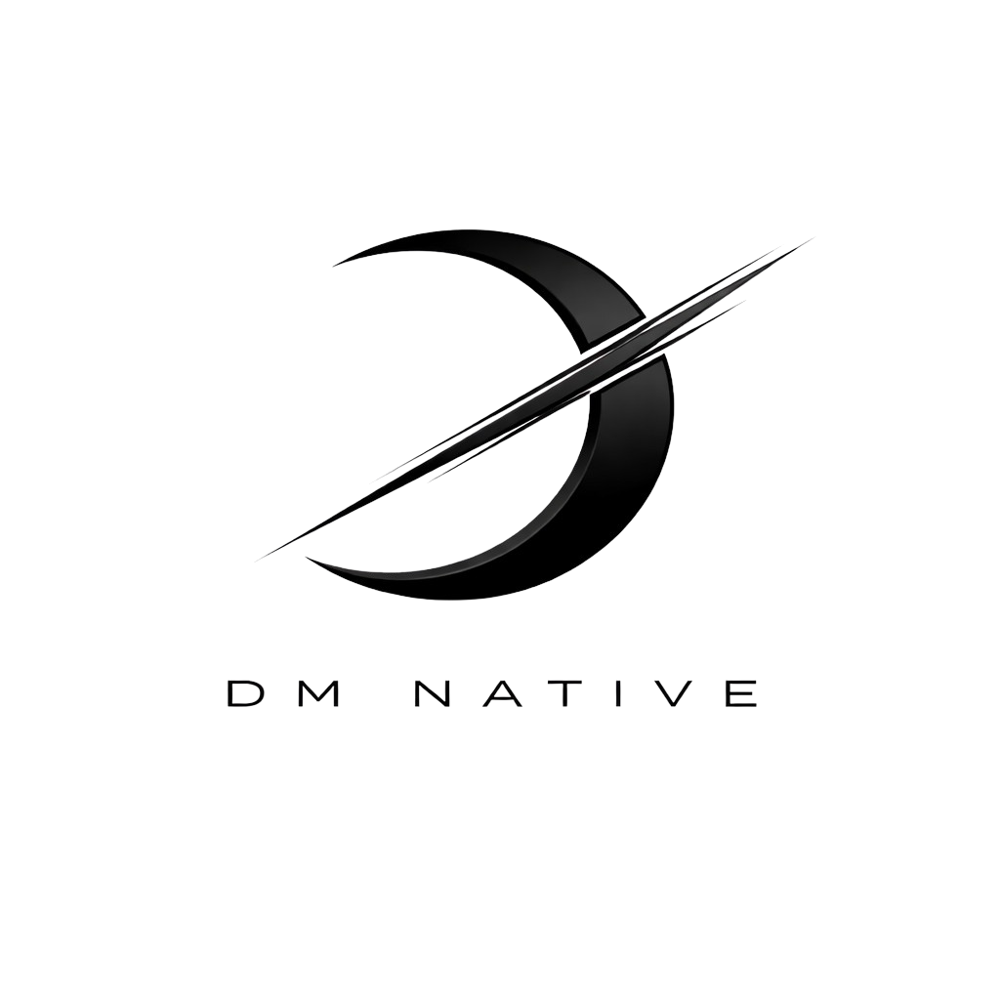
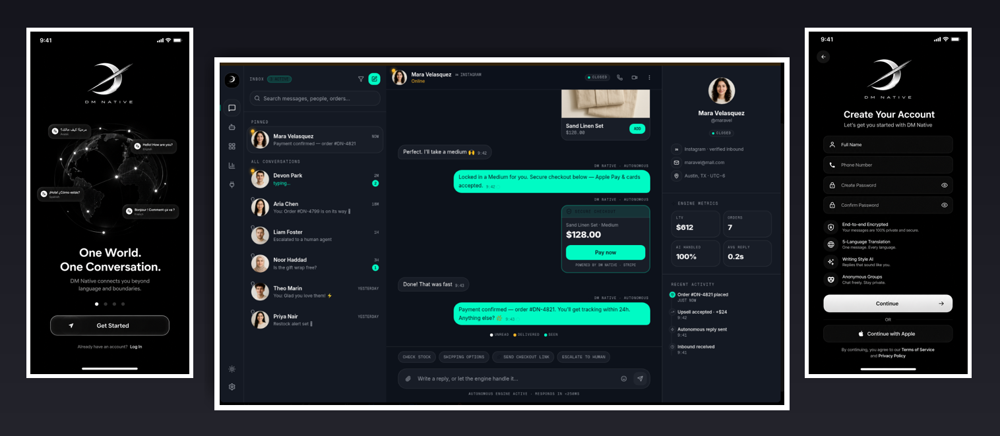

<picture>
  <source media="(prefers-color-scheme: dark)" srcset="assets/logo-dark.png" />
  
</picture>

# DM NATIVE

### Your conversations. Yours alone.

**End-to-end encrypted messaging, built on the edge — so private that our own servers can't read a single word.**

[-00ffbb?style=flat-square)](#-security--cryptography)

[**Website**](https://dmnative.com) · [**Join the waitlist**](https://dmnative.com) · [**Roadmap**](ROADMAP.md) · [**Security**](SECURITY.md)

---

---

## Why DM NATIVE

Most "private" chat apps ask you to trust a company. DM NATIVE is built so you **don't have to**.

Every message is end-to-end encrypted with the **Signal Protocol** (X3DH + the Double Ratchet) before it ever leaves your device. The servers that route your messages only ever see **ciphertext** — opaque, unreadable, useless to anyone who intercepts it, including us. Your keys never leave your phone.

We pair that gold-standard cryptography with a **globally distributed edge backend** (Cloudflare Workers), so privacy doesn't cost you speed — messages travel through the network point nearest to you, anywhere in the world.

> 🔭 **DM NATIVE is in active development, with a public beta on the way.**
> ⭐ **Star this repo to follow the build** — it's the best way to get notified when the beta drops.

---

## ✨ Features

| | |
|---|---|
| 🔒 **End-to-end encryption** | Signal Protocol (X3DH + Double Ratchet, AES-GCM). The server is zero-knowledge. |
| 🕶️ **Anonymous rooms** | Join group conversations under a per-room alias — your real identity is never exposed to other members or stored in any relayed message. |
| 🌍 **Live translation** | Read messages in your language; translation runs at the edge across 20+ languages. |
| 📞 **Voice & video calls** | Peer-to-peer WebRTC calls with the same privacy posture as your chats. |
| 🎙️ **Voice notes** | Send rich audio messages with on-device waveform rendering. |
| 🗳️ **Polls, media, location & more** | Polls, photos/video, files, live location, contact cards, reactions, and replies. |
| 🔑 **Encrypted on-device storage** | Your local message database is encrypted at rest (SQLCipher). |
| 🧠 **Smart replies** | Optional on-device writing-style suggestions — learned locally, never uploaded. |
| ⚡ **Edge-native** | Built on Cloudflare Workers, D1, and Durable Objects for low-latency delivery worldwide. |

---

## 🔐 Security & Cryptography

Privacy isn't a setting in DM NATIVE — it's the architecture.

- **Signal Protocol.** Sessions are established with **X3DH** and every message is ratcheted forward with the **Double Ratchet**, giving you forward secrecy and post-compromise security. Identity keys are **Ed25519**; key agreement is **X25519**; message encryption is **AES-GCM**.
- **Zero-knowledge relay.** The backend stores and forwards **ciphertext only**. Plaintext, private keys, and decrypted content never reach our infrastructure.
- **Authenticated key exchange.** Signed pre-keys are verified against the sender's identity key — a forged or man-in-the-middle key bundle is rejected, not trusted.
- **Anonymous by construction.** In anonymous rooms, real user IDs are stripped server-side and replaced with stable per-thread aliases before any message is relayed.
- **Encrypted at rest.** On-device data is stored in an encrypted database.

> 🛡️ Found a vulnerability? Please read our [**Security Policy**](SECURITY.md) for responsible disclosure. We take reports seriously.

*An independent third-party security audit is planned ahead of general availability; results will be published here.*

---

## 📱 Platforms

| Platform | Status |
|---|---|
| **Android** | Beta incoming |
| **iOS** | Beta incoming |
| **Web** | In development |

Want in early? **[Join the waitlist →](https://dmnative.com)**

---

## 🧱 Built with

- **Apps:** React Native (iOS + Android) and a modern web client
- **Backend:** Cloudflare Workers · D1 · Durable Objects · KV · R2 · Workers AI
- **Crypto:** X25519 · Ed25519 · AES-GCM · HKDF · X3DH · Double Ratchet

---

## 🗺️ Roadmap

DM NATIVE is being built deliberately, security-first. See the full [**Roadmap**](ROADMAP.md) for what's shipping next — encrypted backups, multi-device, sealed-sender, app-store releases, and the public security audit.

---

## 💬 Community

- ⭐ **Star** this repo to follow the journey and get notified at beta.
- 💡 Open a [**Discussion**](https://github.com/dmnative/dmnative-official/discussions) or [**Issue**](https://github.com/dmnative/dmnative-official/issues) — feedback, feature ideas, and translations are welcome even though the app code lives in private repos.
- 🌐 Follow updates at [**dmnative.com**](https://dmnative.com).

---

## ⭐ Star History

---

## 📄 License

© 2026 **DM NATIVE** — **all rights reserved.** This repository, its documentation, and the DM NATIVE name, logo, and brand assets are proprietary and may not be reused, modified, or redistributed without written permission. See [LICENSE](LICENSE). The DM NATIVE application source is maintained in separate, private repositories.

**DM NATIVE** — *messaging that belongs to you.*

[Website](https://dmnative.com) · [Waitlist](https://dmnative.com) · [Security](SECURITY.md) · [Roadmap](ROADMAP.md)

